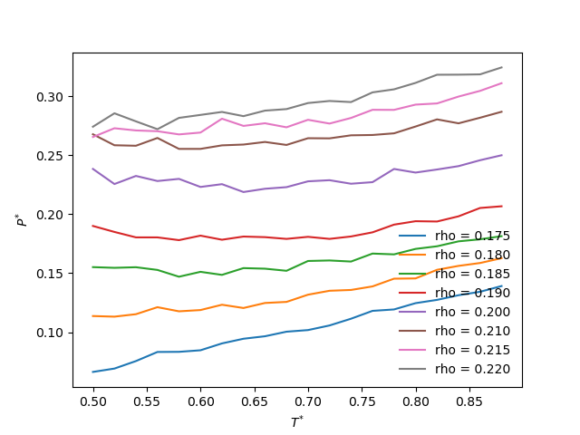

# Franzese potential

This code finds the temperature of maximum density (TMD) for the [potential
proposed by Franzese](https://doi.org/10.1016/j.molliq.2007.08.021) and
[Alan](https://doi.org/10.1063/1.2830706). It calculates the pressure X
temperature curves for fixed densities 0.175, 0.18, 0.185, 0.19, 0.2, 0.21,
0.215 and 0.22. All inputs and outputs are in reduced units.

To run this simulation, [LAMMPS](https://lammps.sandia.gov/) is required.
Potential generation and average calculation are performed using
[Sympy](https://www.sympy.org/) and [Numpy](https://numpy.org/).

Run with
```
bash tmd.sh
```

The figure below is the result for a short simulation (only 150k steps).


