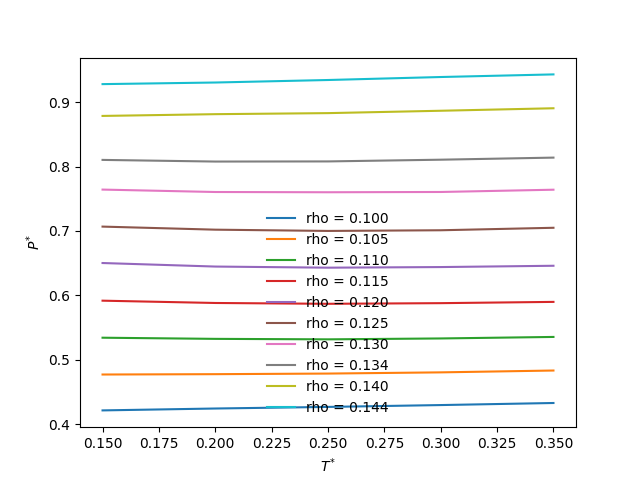

# Franzese potential

This code finds the temperature of maximum density (TMD) for the [potential
proposed by Alan]( http://dx.doi.org/10.1063/1.2168458).  It calculates the
pressure X temperature curves for many densities between 0.1 and 0.114.
All inputs and outputs are in reduced units.

Potential generation and average calculation are performed using
[Sympy](https://www.sympy.org/) and [Numpy](https://numpy.org/).

Run with
```
bash tmd.sh
```

The figure below is the result for a short simulation (only 100k steps).


